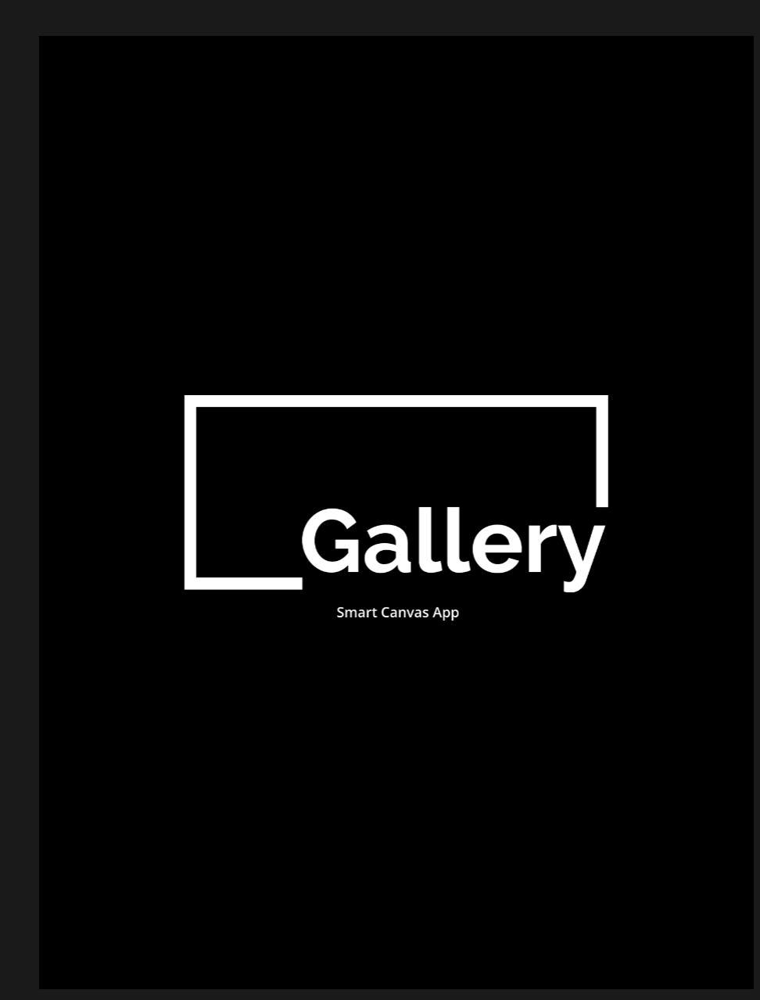
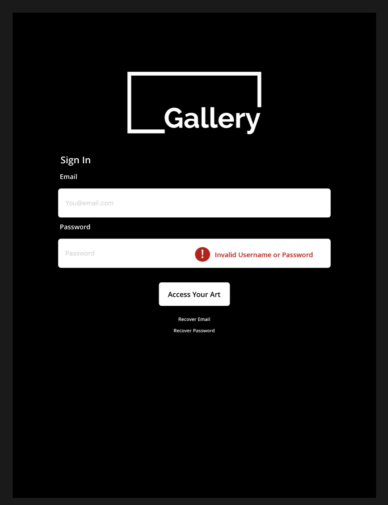
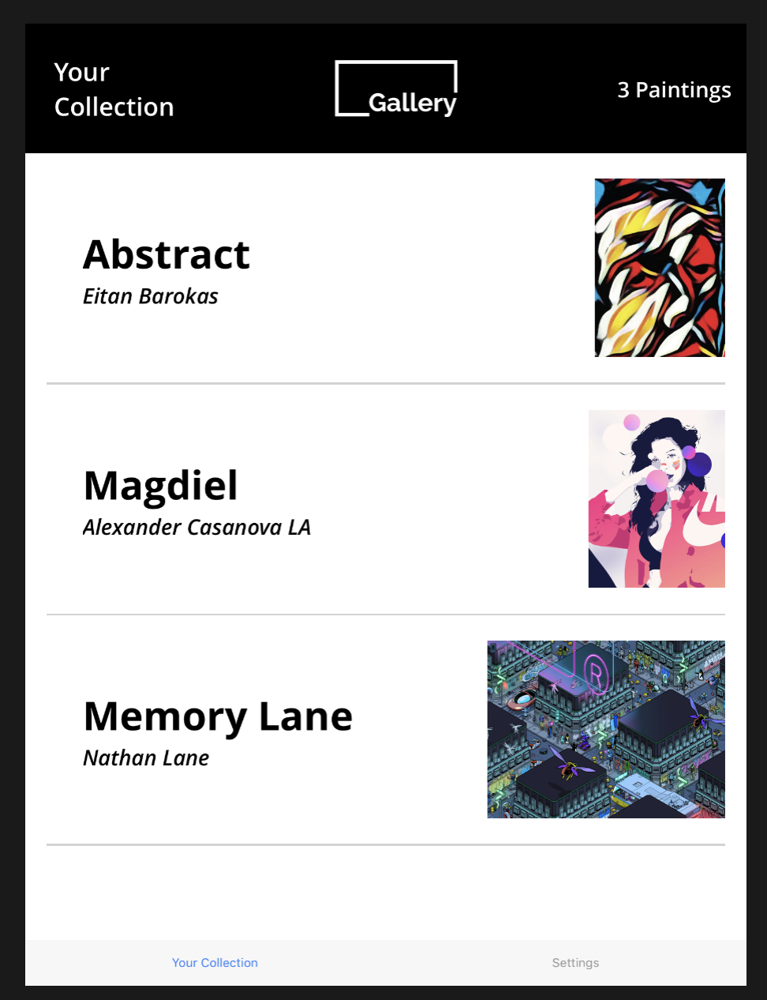

# React Native digital art smart canvas app

This app is a 'smart canvas' app, designed to allow users to view works of digital art that they own.

I made it for my company Gallery, and I am posting it here as an example of a front end project with react native.

Here are the steps to run the app from a terminal:

```
Clone the repository: git clone https://github.com/dcarlcf/ReactNativeExample.git

Enter the repository: cd GalleryMobileFrontend

Run 'NPM Install' to install all dependencies

Make sure that you have Xcode installed so you can run the simulator

Then, run the program: 'react-native run-ios' to see the app on an iPhone 6

To run it on an iPad, run it: 'react-native run-ios --simulator="iPad Pro" ''
```

Here are some screenshots of the app:

 "Loading Page"

 "Login Screen"

 "Paintings"

